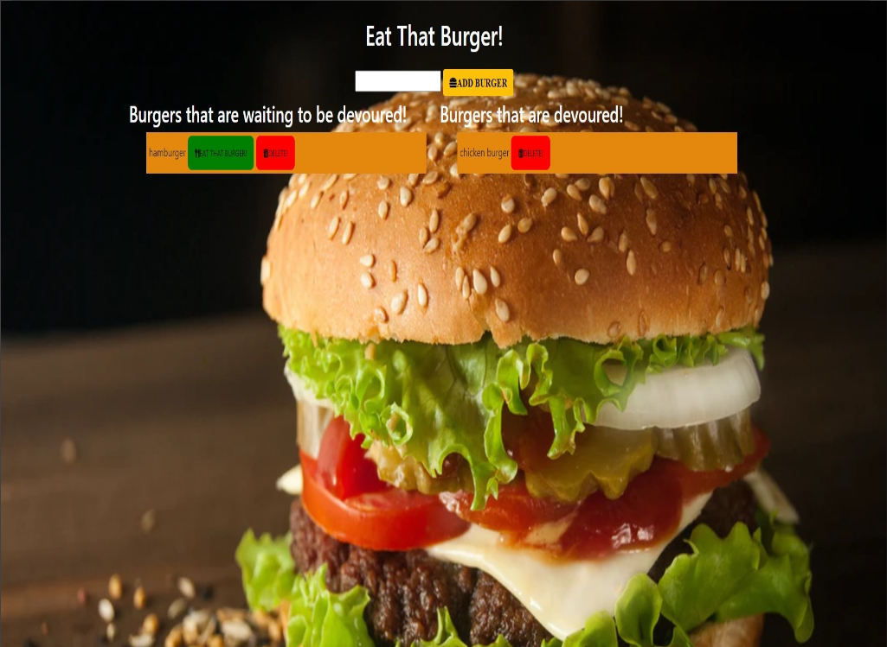
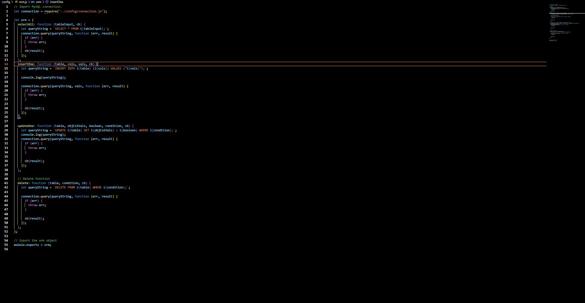

# Eat That Burger - Restaurant App Using Express, MySQL, Node, Express, Handlebars and a homemade ORM

## Overview

Eat that Burger is a restaurant app the lets users to input the names of burgers they'd like to eat.

## Table of Contents

- [Description](#description)
- [Installation](#installation)
- [Usage](#usage)
- [Test](#test)
- [Deployed](#deployed)
- [Tools](#tools)
- [Research](#research)
- [Questions](#questions)
- [License](#license)

## Description

To dynamically and quickly create and delete burger data, Express, MySQL, Heroku and Handlebars were utilized to:

- Serve and display a working data base of burgers available to eat, those that have been devoured and the ability to
  delete burgers.

## Installation

1. Create a .gitignore file and include node_modules and .DS store. This ensures that the node_modules directory isn't
   tracked or uploaded to GitHub.
2. Use the command-line, npm i, to install Express, Express-Handlebars, and mysql npm.
3. To start creating, devouring, and deleting burgers using Express, use the command, node server.js and navigate in the
   web browser to localhost:8080.

## Usage

- Express and Heroku and used to serve and display to the the user Handlebars HTML templated info of their created and
  devoured burgers.
- Handlebars is used to render the HTML.
- Once the user's information regarding:
  - created burger is inputed into the input box:
- An Handlebars HTML file with the user's added burger and unique id is created.
- User's burgers can be deleted based on the id in the MySQL database and the delete routes.

## Test

Test the different HTML pages/positions on the local host using Express, to ensure that the data is saving and the MySQL
database is accessed.

## Deployed

- \*[Deployed website](https://protected-lowlands-49340.herokuapp.com/)
- \*[Portfolio](https://kay0s.github.io/Dynamic-Portfolio/portfolio.html)
- \*[GitHub Repository](https://github.com/Kay0s/burger) 

### Screenshot of Homemade ORM Code

## Tools

- Handlebars.js
- MySQL
- HTML
- CSS
- JavaScript
- .gitignore
- Git Bash
- Heroku
- Express
- node.js
- homemade ORM

## Research

- [Handlebars](https://handlebarsjs.com/)
- [Deploying with MySQL- Heroku](https://devcenter.heroku.com/articles/jawsdb)
- [Unsplash - Burger Image - Ilya Mashkov](https://unsplash.com/photos/_qxbJUr9RqI)

## Questions

- [Email](hamilton.kristina@gmail.com)
- [GitHub Profile](https://github.com/Kay0s)
- [GitHub Repository](https://github.com/Kay0s/burger)

## License

© 2021 Kristina Hamilton and Trilogy Education Services, a 2U, Inc. brand. All Rights Reserved. Permission is hereby
granted, free of charge, to any person obtaining a copy of this software and associated documentation files (the
"Software"), to deal in the Software without restriction, including without limitation the rights to use, copy, modify,
merge, publish, distribute, sublicense, and/or sell copies of the Software, and to permit persons to whom the Software
is furnished to do so, subject to the following conditions:

The above copyright notice and this permission notice shall be included in all copies or substantial portions of the
Software.

THE SOFTWARE IS PROVIDED "AS IS", WITHOUT WARRANTY OF ANY KIND, EXPRESS OR IMPLIED, INCLUDING BUT NOT LIMITED TO THE
WARRANTIES OF MERCHANTABILITY, FITNESS FOR A PARTICULAR PURPOSE AND NONINFRINGEMENT. IN NO EVENT SHALL THE AUTHORS OR
COPYRIGHT HOLDERS BE LIABLE FOR ANY CLAIM, DAMAGES OR OTHER LIABILITY, WHETHER IN AN ACTION OF CONTRACT, TORT OR
OTHERWISE, ARISING FROM, OUT OF OR IN CONNECTION WITH THE SOFTWARE OR THE USE OR OTHER DEALINGS IN THE SOFTWARE.
